# Toadyr (Udyr)

A fan-made League of Legends skin mod by **KamAI Industries**: Udyr reimagined as a mushroom-capped Toad spirit monk. Every stance changes his whole look: outfit, armour, cap colours, amulet, effects and sounds.

**Download:** on RuneForge (search for **Toadyr**).

All screenshots below are taken in game, in the Practice Tool.

## Loading screen

The loading-screen card, so you can tell the mod is active before the game starts.

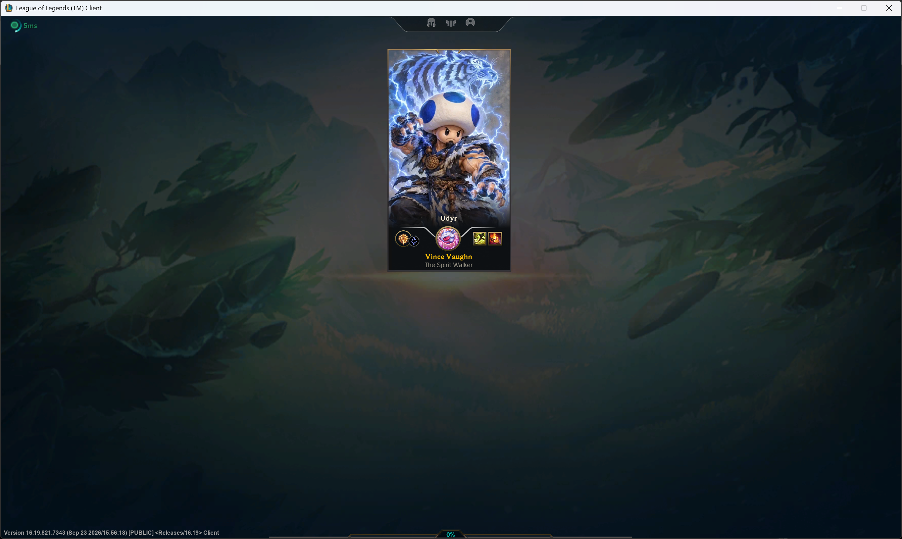

## Neutral

Before he picks a stance: an earthy brown-spotted cap and fur mantle.

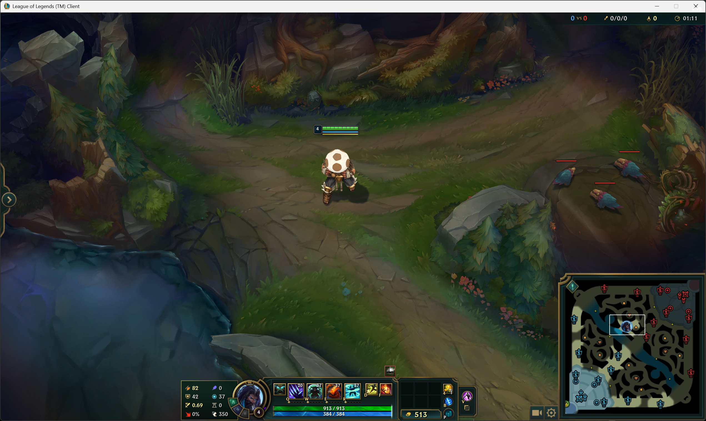

## Tiger (Q)

A shaggy blue-and-white tiger-striped fur mantle, claws and blue tiger tattoos.

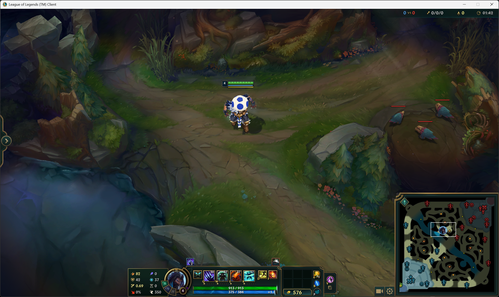

*Tiger stance activated.*

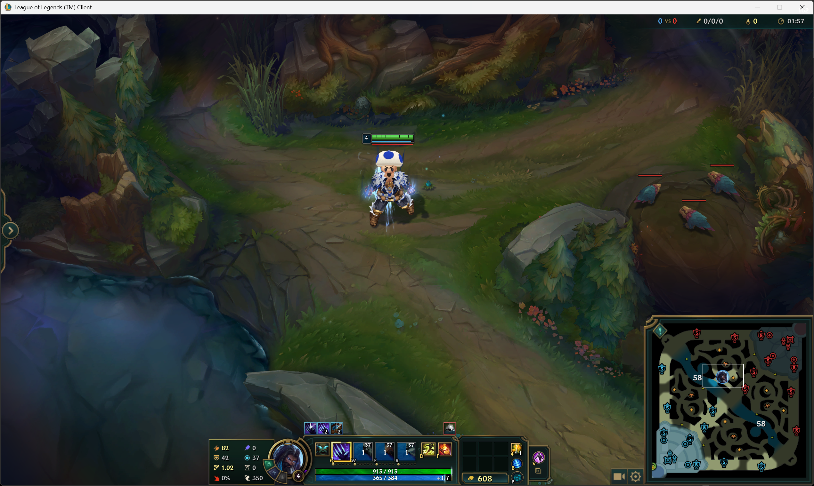

*Awakened Tiger: a lunging electric-blue tiger spirit appears above his head.*

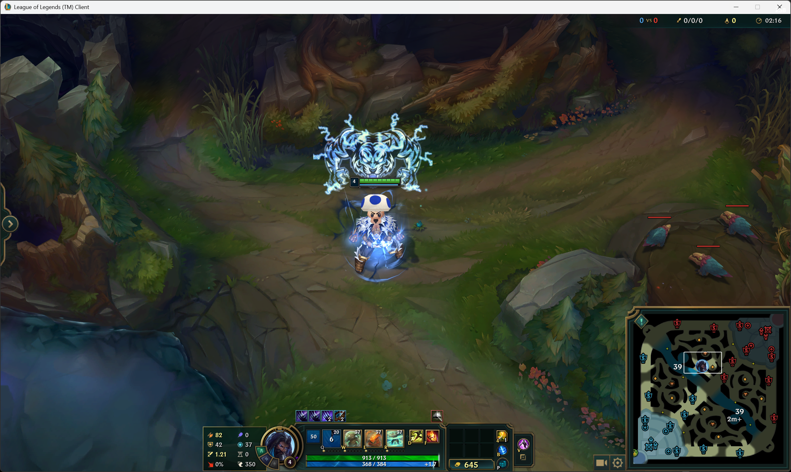

## Turtle (W)

Green Koopa-style shell armour: a round back shell and two shoulder shells.

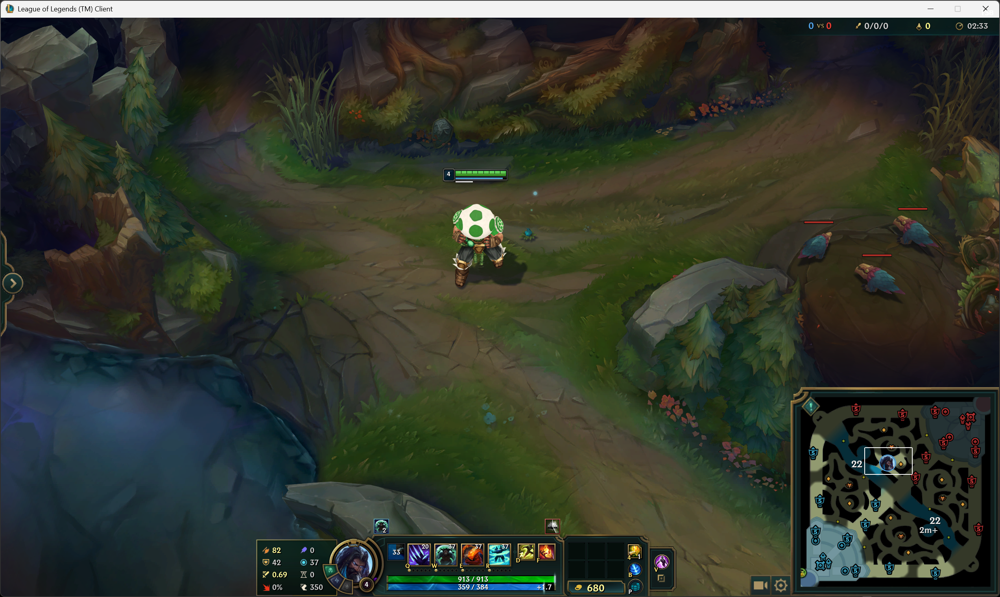

*Turtle stance activated.*

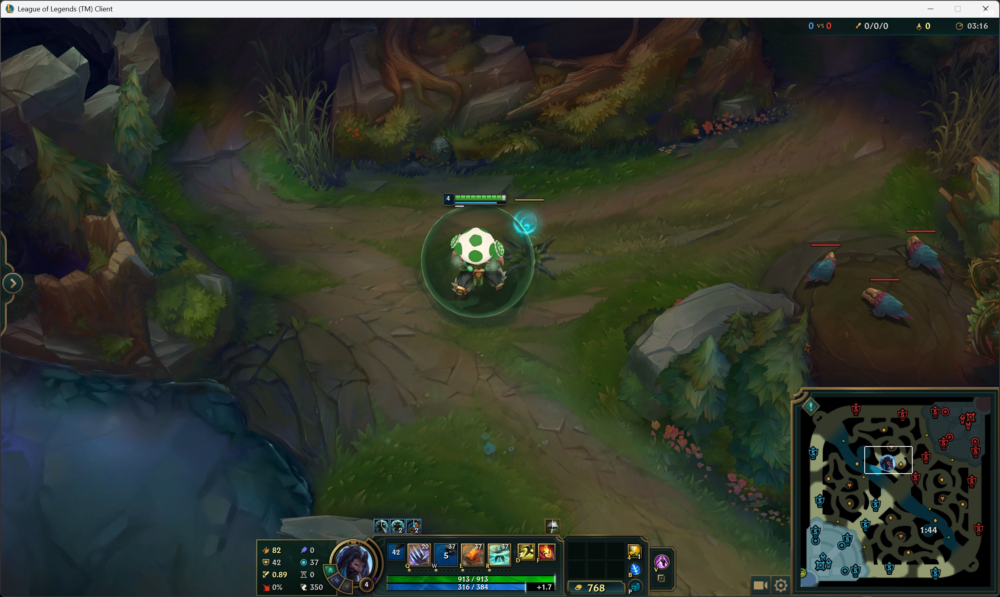

*Awakened Turtle: the glowing turtle spirit.*

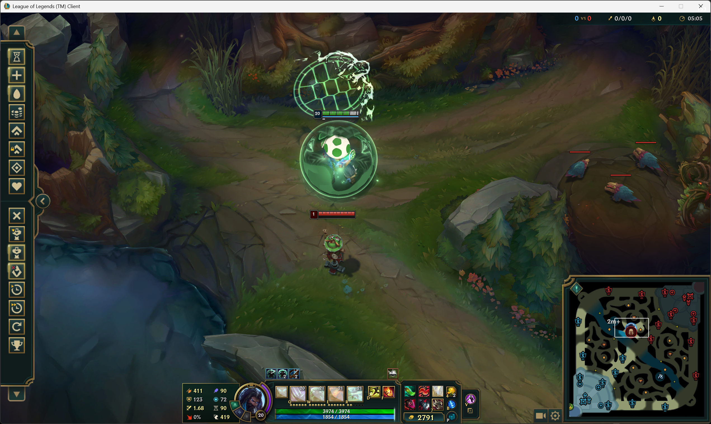

## Eagle (E)

A flowing white feather mantle and a winged cap.

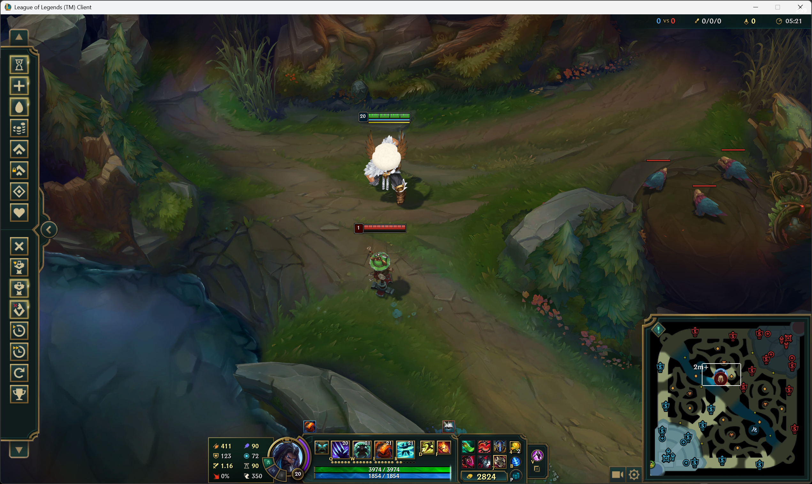

*Awakened Eagle: the white spectral eagle spirit.*

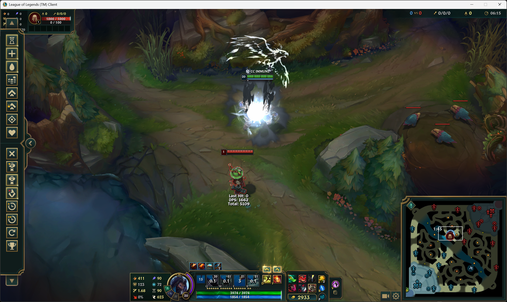

## Dragon (R)

Dragon-scale pauldrons with gold rivets, a dark ember-tipped fur mantle and red tattoos.

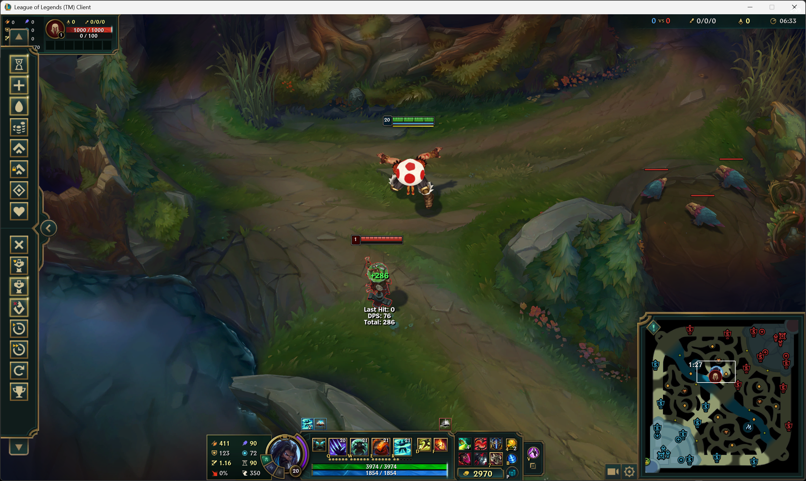

*Dragon stance: the storm.*

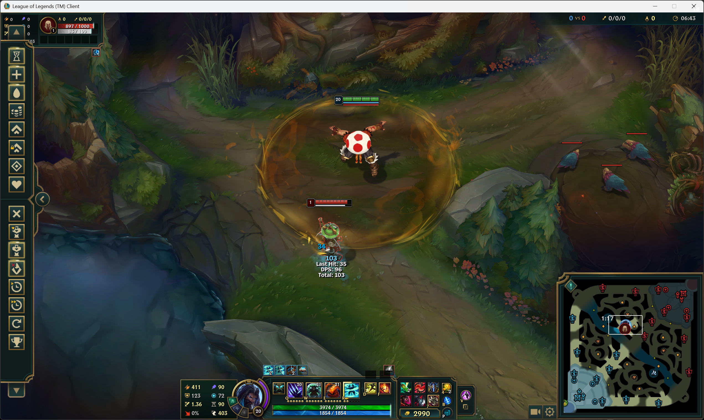

*Awakened Dragon: the flaming dragon spirit, with a fire-dragon emblem under the storm.*

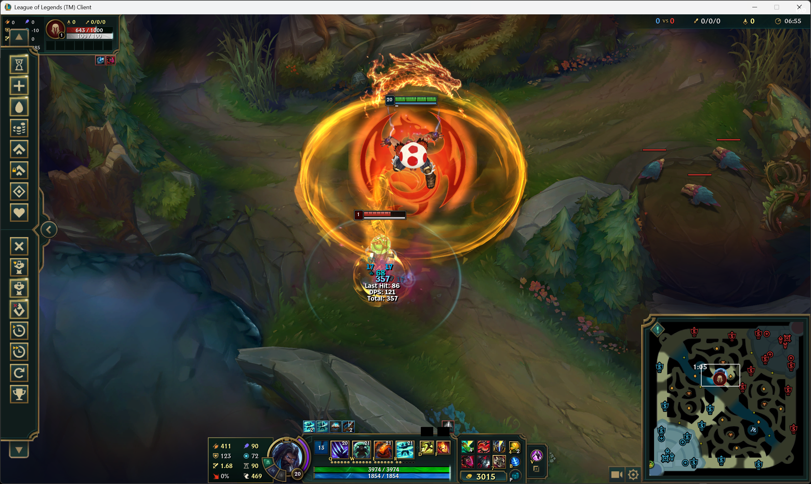

## Credits and licence

- Made by **KamAI Industries**. The mod is licensed under CC BY-NC 4.0 (non-commercial, with credit to KamAI Industries).
- Tiger-head icon by Delapouite and eagle icon by Lorc, from game-icons.net, licensed under CC BY 3.0.
- Toadyr is a fan-made mod. League of Legends and its assets belong to Riot Games, and Toad belongs to Nintendo. It isn't endorsed by Riot Games or Nintendo.
