# Toadyr (Udyr)

A fan-made League of Legends skin mod by **KamAI Industries**: Udyr reimagined as a mushroom-capped Toad spirit monk. Every stance changes his whole look: outfit, armour, cap colours, amulet, effects and sounds.

**Download:** on RuneForge (search for **Toadyr**).

The images and clips below are rendered straight from the mod's own model, textures, animations and effects. Click any clip to download its full 1080p video (MP4).

The ability clips play the mod's own particle effects (its textures, colours, meshes and timings) through a re-creation of League's effect system. They're very close to what you see in game, but they aren't captures of it. All twelve back to back: [toadyr-abilities.mp4](media/videos/toadyr-abilities.mp4?raw=true).

## Neutral

Before he picks a stance: an earthy brown-spotted cap, a shaggy fur mantle and a spiral amulet.

## Tiger (Q)

A shaggy blue-and-white tiger-striped fur mantle, a fur skirt, claws and blue tiger tattoos. Casting Q crackles blue lightning around him and his fists. Awakened, lightning strikes down as the electric-blue tiger spirit appears above him, and a crackling aura stays on him.

| Tiger stance | Awakened Tiger |
|:---:|:---:|
|  |  |

| Idle | Q activation | Awakened Q |
|:---:|:---:|:---:|
| [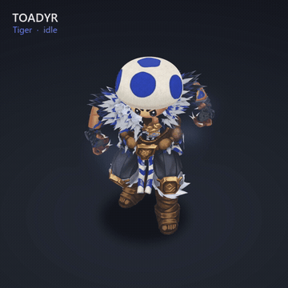](media/abilities/tiger-idle.mp4?raw=true) | [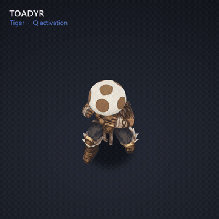](media/abilities/tiger-activation.mp4?raw=true) | [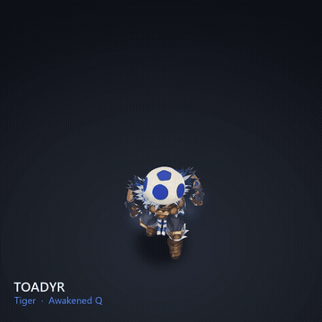](media/abilities/tiger-awakened.mp4?raw=true) |

## Turtle (W)

Green Koopa-style shell armour: a round back shell and two shoulder shells carrying the turtle amulet's hex pattern. Casting W raises a green shield bubble around him. Awakened, the glowing turtle spirit appears above him as he heals and the bubble holds.

| Turtle stance | Awakened Turtle |
|:---:|:---:|
|  |  |

| Idle | W activation | Awakened W |
|:---:|:---:|:---:|
| [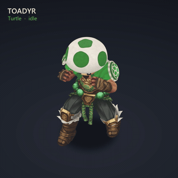](media/abilities/turtle-idle.mp4?raw=true) | [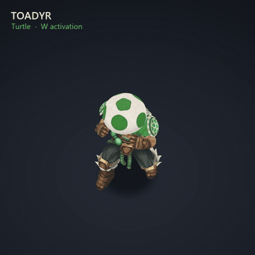](media/abilities/turtle-activation.mp4?raw=true) | [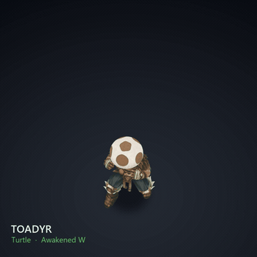](media/abilities/turtle-awakened.mp4?raw=true) |

## Eagle (E)

A flowing white feather mantle and a winged cap. Casting E bursts a white wind swirl around him (its speed trails show when he runs). Awakened, a white burst breaks over him as the spectral eagle spirit appears above him.

| Eagle stance | Awakened Eagle |
|:---:|:---:|
|  |  |

| Idle | E activation | Awakened E |
|:---:|:---:|:---:|
| [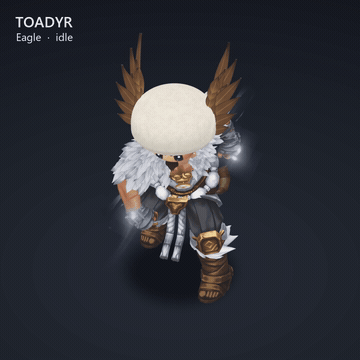](media/abilities/eagle-idle.mp4?raw=true) | [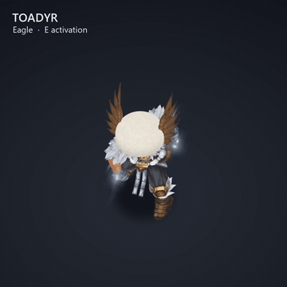](media/abilities/eagle-activation.mp4?raw=true) | [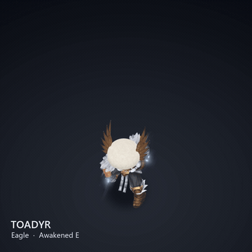](media/abilities/eagle-awakened.mp4?raw=true) |

## Dragon (R)

Dragon-scale pauldrons with gold rivets, a V of scales down the back, a dark ember-tipped fur mantle and red tattoos. Casting R summons a storm of fire swirling in a ring around him. Awakened, the flaming dragon spirit appears above him and the storm blazes brighter, with a soft fire-dragon emblem glowing under it.

| Dragon stance | Awakened Dragon |
|:---:|:---:|
|  |  |

| Idle | R activation | Awakened R |
|:---:|:---:|:---:|
| [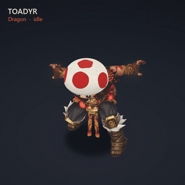](media/abilities/dragon-idle.mp4?raw=true) | [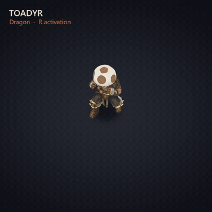](media/abilities/dragon-activation.mp4?raw=true) | [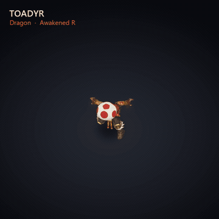](media/abilities/dragon-awakened.mp4?raw=true) |

## Recall

He sets his feet and does the dancing stormtrooper's hip thrust on every beat, grabbing the air between thrusts. The five Toad hats (neutral, tiger, turtle, eagle and dragon) pop up around him one by one, on the beat, to "Voxel Revolution" by Kevin MacLeod.

*Click to download the video with the music (MP4).*

## Death

His body goes poof in a puff of smoke. All that's left is his Toad cap, from the stance he died in and 25% bigger. It drifts down to the ground like a feather and stays there until he respawns.

## Ability icons, portrait and loading screen

New Q, W, E and R icons, each showing the Toad with that stance's spirit, plus the passive and the HUD portrait.

The loading-screen card:

## Credits and licence

- Made by **KamAI Industries**. The mod and these images are licensed under CC BY-NC 4.0 (non-commercial, with credit to KamAI Industries). See [LICENSE](LICENSE).
- Ability icons, passive icon, portrait and loading-screen card: KamAI Industries' own artwork. The fire-dragon emblem was also supplied by KamAI Industries.
- Recall music: "Voxel Revolution" Kevin MacLeod (incompetech.com), licensed under Creative Commons: By Attribution 4.0 (http://creativecommons.org/licenses/by/4.0/). 0:24 to 0:32 is used.
- Tiger-head icon by Delapouite and eagle icon by Lorc, from game-icons.net, licensed under CC BY 3.0 (used for the amulets).
- Toadyr is a fan-made mod. League of Legends and its assets belong to Riot Games, and Toad belongs to Nintendo. It isn't endorsed by Riot Games or Nintendo.
